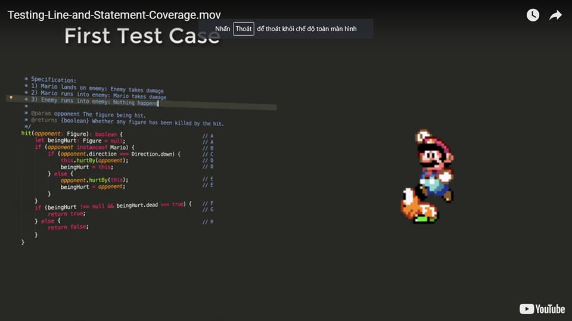
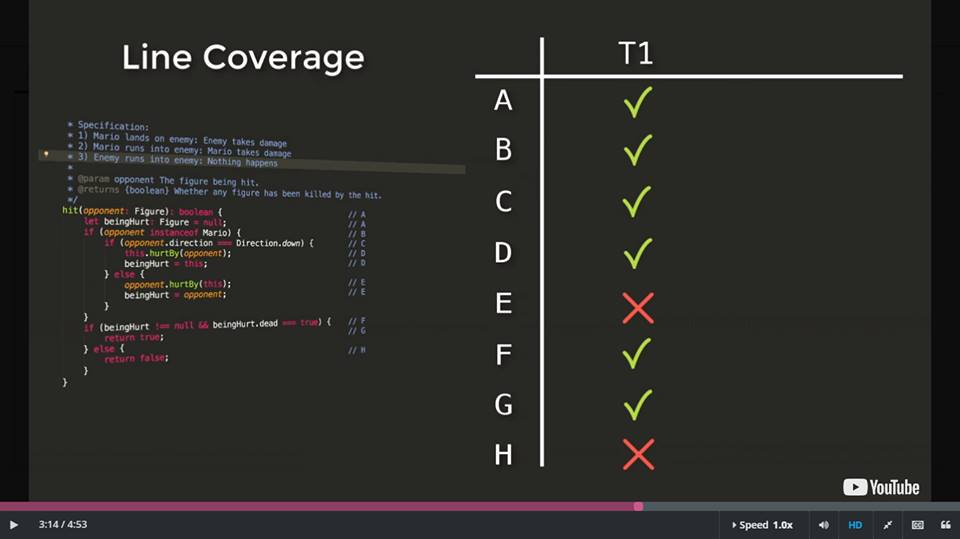

## Công nghệ phần mềm

### Kiểm thử

---

### White Box Testing: Coverage

- Làm thế nào để biết rằng code của mình đã được test đủ?

---

### Mục tiêu của việc test

- Đảm bảo code thực thi đúng đặc tả
    - Liệu code đã làm đúng nhiệm vụ
- Tìm những lỗi trong code
- Hiểu được chỗ mà ta có thể tìm được lỗi

---

### Không phải mục tiêu (non-goal)

- Đảm bảo hệ thống không lỗi
    - Vì không có đủ thời gian trong hệ thống của ta
    - Và cuối cùng thì ta muốn tạo hệ thống phần mềm có ích cho người dùng

---

### Coverage - bao phủ

- Là công cụ để đo lường tỉ lệ hệ thống được thực thi bởi một bộ test
- Được tính:
    - Tỉ lệ bao phủ = (covered / (covered + uncovered)) * 100
- Gồm 2 loại:
    - Flow independent - dòng độc lập
    - Flow dependent - dòng phụ thuộc

---

### Flow independent

- Dễ tính toán
- Dễ giải thích
- Đảm bảo việc chạy từng mảnh hệ thống thành công
- Gồm: 
    - Block Coverage - Bao phủ theo khối 
    - Line Coverage - Bao phủ theo dòng (*)
    - Statement Coverage - Bao phủ theo điều kiện (*)
    
---

### Flow dependent

- Đảm bảo các dòng code có thể thực thi cùng nhau
- Khó tính toán giải thích
- Cho ta cái nhìn sâu sắc hơn trong việc vận hành
- Gồm:
    - Branch Coverage - Bao phủ theo nhánh (*)
    - Path Coverage - Bao phủ theo đường (*)
    - MCC Coverage - Mở rộng của path coverage
    
---

### Coverage là 1 quá trình lặp

1. Định danh những dòng code chưa được bao phủ
1. Thiết kế các bộ test để chạy các dòng code đó
1. Viết và chạy test để đảm bảo các dòng code đó qua được các test
1. Lặp lại đến khi đạt được mục đích bao phủ - 'coverage'

---

### Line và Statement Coverage

- Test 1: turtle.hit(new Mario({direction: down}));

---

### Line và Statement Coverage

---

### Line và Statement Coverage

- Test 2: turtle.hit(new Mario({direction: right, state: big}));

